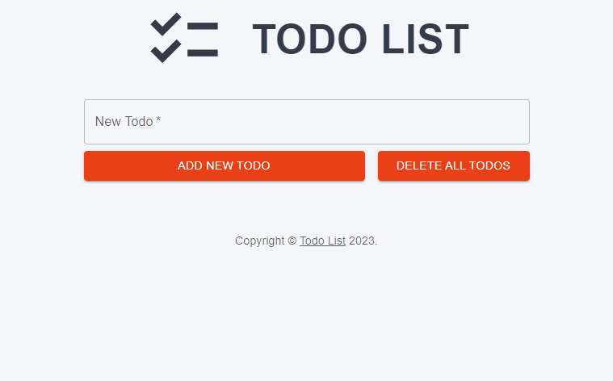
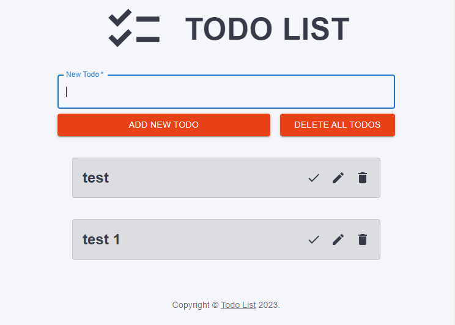
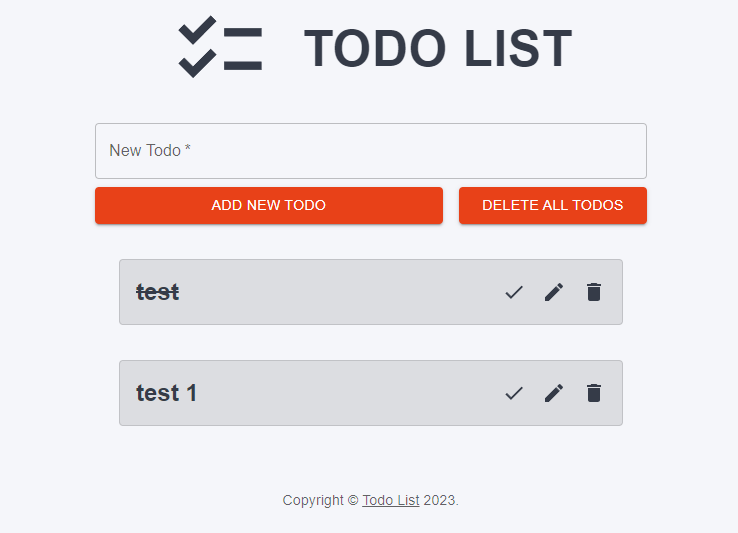
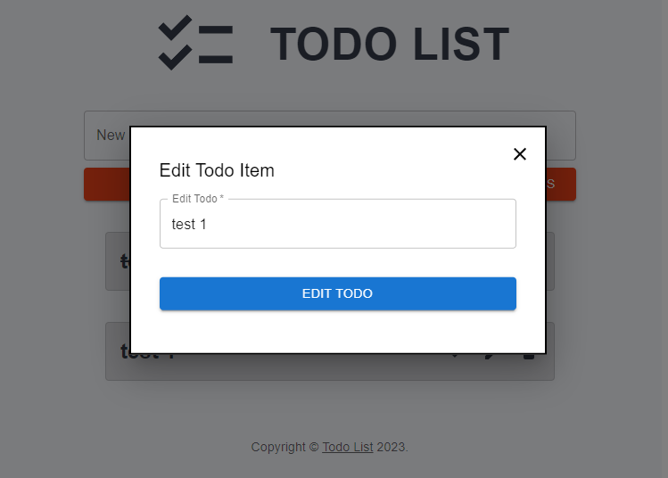
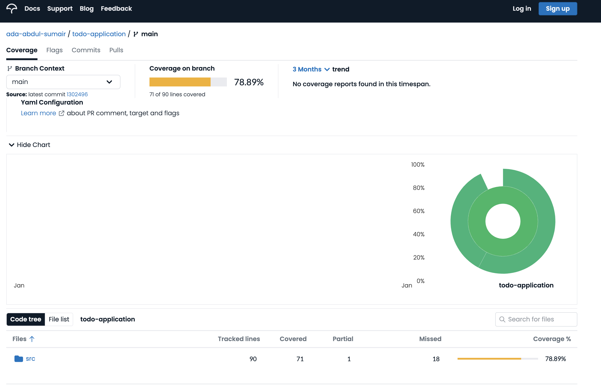

# Todo-Application

- Todo application for SQA assignment 2

## <ins>Project Description</ins> SUMAIR

This project is a simple To-Do list application, created to enable users to track what tasks they have completed, and what they still have left to do. The program has been designed to be used for a plethora of different purposes, some of which may include tracking your chores, shopping, or daily tasks.

### **Here are the features included in the application:**
- Add new todo items
- Delete todo items
- Edit a todo item
- Delete all todo items

The application features a simple and easy to use UI, with a singular page, that can dynamically scale as todo items are added.

### Empty todo list:


### Todo list with items:


### Checked todo item:


### Edit todo item modal:



`Todo app homepage`


`Added Todo`


`Edit Todo popup`


## <ins>Team Description</ins> SUMAIR
Our team consisted of only two members. Due to this, each member undertook multiple roles in the team. Despite having individual roles, we wore multiple hats and discussed features collaboratively in our daily standups. 

**Abdul-Subhan Latif** - Abdul-Subhan was the lead QA tester on the team. His role in the project entailed writing tests for the application and ensuring SQA practices were implemented throughout the project lifecycle. Alongside this, Abdul-Subhan was heavily involved in the planning stage, designing the initial Figma for the Front-End and outlining the functional and non-functional requirements for the project.

Abdul-Subhan Key Roles:
- Writing tests
- Implementing linting checks
- Implementing code formatter
- SQA practices
- Reviewing pull requests
- Smoke testing pull requests
- Lead designer
- Contributing to documentation
  
**Sumair Ruhani** - Sumair was the lead developer on the team. He designed and implemented the core functionality for the To-Do app, alongisde styling it based on the Figma designs. Alongside this, Sumair was responsible for ensuring CI/CD practices were implemented in the project, by writing GitHub actions and Git Hooks. 

Sumair Key Roles:
- Writing the program
- Git Hook for enforcing conventions
- Implementing automated testing
- CI/CD practices
- Reviewing pull requests
- Smoke testing pull requests
- Project Manager
- Contributing to documentation
  
Both members of the team evenly split the workload between themselves, with one primarily focused on developing the app and implementing CI/CD practices, while the other was focused on writing tests and ensuring SQA practices where met. Therefore, the contribution from each member was 50% each.

_Note: The line contributions is **NOT** an accurate reference for the contributions from each member, due to an error where the `node_modules` (prewritten packages) were committed alongside the rest of the code, causing the lines committed to be more than it should be for one member._
_For a more accurate representation of code contribution, please go through each pull request, to view contributions from each member. This can be done using the search filter on the pull requests tab of the repository and setting the filter to: `is:pr is:merged`_

## <ins>Tools Used</ins> SUMAIR

- version control - GitHub
Version & source control
Reviewing
Pipeline tests

- testing - Jest / React Testing Library
Unit testing (of components, main page)
Integration tests (functionality)

- test code coverage
Code Cov (TO DO)

- frameworks and libraries - React / MUI
React - for FE
Material UI (MUI) - premade components

### _Linters_

_ESLint_

This project utilisies ESLint for analysing JavaScript code for potential errors, styling issues, and adherence to coding standards.
ESLint rules have been defined by the team in the .eslintrc.js file, in rukles for errors, warnings and styling have been customised.
ESLint has been integrated in the `package.json` file to run after each commit and after each push.
To manually run the linter on the code, run the command:

```
npx eslint .
```

Prettier - code formatting

- project management tools
Figma - designs
Jira - kanban board
Git - version controlling

- performance and accessibility audit
Google Lighthouse (TO DO)

## <ins>Instructions to Run and Use the Application</ins>

### How to clone the repository

Navigate to the application's public GitHub repository via this link: 
[`https://github.com/sumairruhani2/todo-application`](https://github.com/sumairruhani2/todo-application)

Clone the repo locally by running `git clone ` followed by the HTTPS or SSH link 

### How to start the application

Open the codebase and run `npm i` from root level

Run `npm run start` and wait until a browser opens with the application

### Features of the application

With this app, users can:
- Add text in the textbox and submit with the `Add New Todo` button
- Edit text of existing Todos with the edit button on the Todo
- Mark Todos as done which adds a strikethrough to the text
- Delete individial Todos with the delete button on the Todo
- Delete all Todos with the `Delete All Todos` button

## <ins>Project Workflow</ins>

### Project management strategy

This project adopted an agile strategy utilising the Scrum-Kanban hybrid frameworks. 
The team decided this hybrid approach was the most suitable for this project for the following reasons:
- Flexibility - Scrum provides structure with fixed-length sprints while accommodating changes in priorities and incorporating a continuous flow of work with Kanban
- Continuous Delivery - A balance between regular delivery milestones with sprints in Scrum and a continuos delivery model with Kanban allows results to be yielded faster
- Enhanced Visual Management - Kanban utilises collaborative visual boards to represent work flow
- Enhanced Collaboration - Scrum promotes regular check-ins with regular ceremonies and communication and Kanban encourages continuous collaboration.

### Retrospectives

As part of the Scrum framework, daily retrospectives were held at the earliest time in the mornings to provide updates regarding features, bugs, blockers or any other project detail. 
Retrospectives sometimes took place Google Chat instead of a call via Google Meet; this made technical comments and questions easier to process and respond to appropriately. 
Having only 2 members in the team allowed for greater flexibility in communication methods and timings

### Kanban board

A kanban board was created using Jira Software. 
2 types of tickets were used: features, for any new changes, and bugfixes, for fixing broken features
The board contained the following columns:
- `To Do` - all the created tickets were stored under this heading until picked up
- `In Progress` - tickets were assigned and picked up in this column
- `Review` - once a PR was created, the corresponding ticket was moved to this column
- `Done` - once a PR was merged, tickets were marked as completed in this column

The board can be viewed via this link:
[`https://jira.external-share.com/issue/102592/abdul-subhan_latif_@_board_share`](https://jira.external-share.com/issue/102592/abdul-subhan_latif_@_board_share)

## <ins>Test Methodologies and Tools</ins>

### Types of tests

The Todo app underwent multiple phases of testing to ensure reliability and functionality. 
Here are the forms of testing carried out and at what stage in development they occurred:

- Manual smoke testing - For each PR, the contributor carried out build verification testing by running the app and manually adding, editing, and removing Todo items, to ensure essential features and components of the app were still functional after changes were made. Each smoke test followed a testing table which contained the criteria for expected and actual results. 
- Sanity testing - After a functional feature was added or fixed, this form of narrow regression testing was manually carried out by running the app and using the new feature/fix to ensure the minor changes or bug fixes worked as intended
- Unit testing - For each React component created, each one required automated testing in isolation to test the functionality, its methods, and how it behaves with different inputs. This was automated with the Jest library to simulate component rendering, user interactions, and check the component's internal state and behavior. 
- Integration testing (UI testing) - After building each React component, the interactions and collaboration between multiple components were tested to ensure that they work correctly together as a unit with the desired functionality. UI testing was automated with Jest, simulating user interactions such as clicking buttons, entering text into input fields, and reloading pages. 

Automated tests were created and integrated in the CI pipelines; a workflow was added so that all the tests ran on every PR and reran automatically every time something was pushed to it. 

Codecov was implemented to show the code coverage and which lines ran or didn't run with the automated tests. 
Codecov results for the repo can be viewed via this link:
[`https://app.codecov.io/gh/ada-abdul-sumair/todo-application`](https://app.codecov.io/gh/ada-abdul-sumair/todo-application)

### Testing screenshots

`Jest tests running locally in the terminal`


`Pipeline tests automated workflow on GitHub`


`Codecov repo lines covered`



`Test tables to run manual smoke testing`


## <ins>Coding Best Practices</ins> 

### Variable naming conventions

The declared variables across the codebase follow a set of rules.
`camelCase` is used for defining variables 
`PascalCase` is used for defining functions 
Descriptive naming is used to give enough detail about the purpose of the variable
Appreviations are used where possible to avoid names getting too long

### Repo structure

This repo follows the folder structure created by the create-react-app tool in order to bootsrap this React project. 
Static files go into the public folder
Source files go into the src folder
React components go into the components folder
Tests are written in a test folder placed at the level of the file being tested
All configuration files for dependencies are stored at the rool level

### Linting

The linter used for this app is ESLint. 
The configuration `.eslintrc.json` file extends the react-app preset, which is the default configuration for Create React App projects.
The configuration also contains the plugin:prettier/recommended preset, which enables the integration with Prettier, a code formatter.
Husky and lint-staged are used to run ESLint as pre-commit and pre-push Git hooks, meaning that before every commit to Git and push to GitHub, the code will be automatically linted and formatted.

### Formatting

The formatter tool for this React app is Prettier. 
The configuration `.prettierrc.json` file lists the formatting features that will take place. Prettier will:
- Turn double quotes into single quotes
- Add semicolons to the end of lines
- Set the number of spaces for indentation levels to 2 spaces
- Add trailing commas to the end of lists in objects and arrays
- Keep line endings consistent
A `.prettierignore` file contains the files that the formatter will skip formatting. 
The repository uses Prettier as a pre-commit Git hook, meaning the code will be automatically formatted by Prettier before every commit.

### Conventional commits

Each PR title is written using a conventional commit format. 
Conventional commits are a set of rules for creating an explicit commit history, describing the features, fixes, and breaking changes.
The basic structure for conventional commits is as follows:
`<type>: <description>`
The `<type>` indicates the kind of change that the commit introduces, such as feat or bug
The `<description>` is a concise summary of the change
An example is: `feat: add todo list component`

### Git Hooks

Git hooks are scripts that Git automatically executes primarily on a local machine before or after events (like committing, pushing, pulling, etc).
These hooks tailor the Git workflow to project-specific needs by enforcing coding standards, running tests, and preventing commits that don't meet predefined criteria.
Default Git hooks are stored in `./.git/hooks`.
Created hooks are kept in `./git-hooks`
The hooks created for this project are:

### Branch naming conventions

Branches should be identified as feature|task|bugfix|hotfix, followed by the JIRA task id and a description, for example:

```
feature/TODO-999_enforce_branch_naming_conventions
```

To ensure that branch names adhere to the specified conventions, we have set up a Git hook. Follow the steps below to set up the hook in your local repository.

Make the script file executable:

```
chmod +x setup-hooks.sh
```

Run the script file to download and set up the git hook:

```
./setup-hooks.sh
```

## <ins>CI Pipeline</ins> SUMAIR

- how the CI pipelines were set up

- snapshots of test suite results
Pipeline screenshots

- PR strategies applied
Trunk-based development

(make note about cannot merge until reviewed)
(explain how actions work)

### _GitHub Actions_

GitHub Actions are workflows defined in code, stored alongside the code in a repository. GitHub Actions automate the SDLC, from building and testing to deploying. They are triggered by events, and executed in GitHub-hosted runners, allowing easy integration with GitHub repositories. Likewise, they sit directly in the GitHub Pipeline, dictating what can be merged into the codebase, based on their outcomes.

The GitHub Actions integrated in this repository are:

- **Automatic Reviewer assign** - Whenever a pull request is created, an appropriate reviewer is assigned. Since our project had two members, whenever one member created a pull request, the action automatically assigned the other member as a required reviewer. The reviewer recieves an email notification informing them that they need to review the pull request. This removes the need for the developer to manually add reviewers. Likewise, this prevents the situation where users forget to assign reviewers to their pull request, resulting in it sitting and becoming stale, which is bad practice.

- **Automatic author assign** - Whenever a pull request is created, the creator of it is automatically assigned as the author. This removes the step for developers to manually assign themselves as an author (which is often forgotten about) and ensures the reviewer knows who was responsible for the pull request. Although this feature isn't necessarily required with only 2 people working in the codebase, it is a good practice to implement regardless. 

_Note: The automatic reviewer assign and automatic author assign features have been created as part of the same GitHub action_

- **Automated testing** - An Action has been written to automatically run all tests within the codebase in the pipeline, including all unit tests and integration tests. The action is triggered whenever a pull request is created, or updated. It runs using NodeJS in the GitHub pipeline and will log all of the tests that have successfully passed or failed during the testing process. If any tests fail, they are logged, and merging will be blocked until it is fixed. This ensures that only high quality code that passes the tests are merged.

`GitHub Workflows in a PR`


## <ins>SQA Standard: IEEE 730</ins> 

### Description of IEEE 730

IEEE 730 is a common standard for software quality assurance. 
This standard describes the activities and tasks that should be performed to ensure high quality of software products. It establishes clear requirements for initiating, planning, controlling, and executing the software quality assurance processes on a project. 
It covers topics from management, documentation, reviews, audits, testing, problem resolution, and configuration management. 

### Reasons for choosing IEEE 730

Reasons for choosing this SQA standard for this project include:
- Defines quality objectives and criteria for this app, and how to measure and verify them throughout the development process.
- Establishes the roles and responsibilities of the QA testers, and how they will communicate and coordinate with each other.
- Plans and executes the QA activities and tasks, like code reviews, unit testing, and integration testing, and documents the results and outcomes.
- Identifies and resolves any quality issues or defects that may arise during the development process, and prevent them from reoccurring in the future.
- Manages and controls the changes and configurations of the software, ensuring their consistency and traceability.

### Key implementations of IEEE 730

The IEEE 730 standard was adhered to all throughout the project. Most notably in the following places:
- The README file provides an overview of the project, its objectives, features, instructions for installation and usage, and other relevant documentation. It also contains information of how the team documented the software quality assurance plan, including the quality objectives, criteria, standards, roles, responsibilities, resources, tools, and methods. 
- A CODE_REVIEW section (used and formatted by GitHub) that records the code review process, including the reviewers, criteria, checklist, feedback, and actions taken for each PR. 
- TESTING files that carry out the testing process, including relevant test cases, test data, test results, and test coverage (using codecov) for each part of the codebase.
- A CONFIGURATION_MANAGEMENT version control system in the form of Git that tracks the configuration management process, including the configuration items, baselines, versions, changes, and audits for each iteration. 

## <ins>Performance and Accessibility Audit</ins>

### Google Lighthouse

Google Lighthouse is a tool used for measuring and improve the quality of your web pages. 
It can run audits for performance, accessibility, progressive web apps, and SEO. 
Lighthouse generates a report on how well the web app does, and provides suggestions on how to fix any issues.
This repo uses Lighthouse for auditing the performance and accessibility of the webpage. 
Lighthouse runs in Chrome DevTools, from the command line, as a Node module, or as a web UI. 
To test the flexibility of the application, Lighthouse allows for loading the webpage with a mobile view as well as a desktop view.

### Snapshots

Click [here](./img/Lighthouse%20audit%20summary.pdf) to view Lighthouse's generated audit summary

`Lighthouse audit for mobile view`


`Lightouse audit for desktop view`


`Lightouse audit for desktop view in incognito`


### Results

Google Lighthouse's audit results prove the clear high quality in the accessibility, best practices, and search engine optimisation (SEO) of the application. 
The performance varied across desktop and mobile layouts. 

The accessibility is due the React components being versatile in the way they load on the DOM as they adjust with the screen width instead of overlapping or hiding, which usually traps the user focus. 
From an inclusive perspective, orange was used for button colours as it is one of the most common colour-blind friendly colours that can be integrated in a project. 
The best practices refers to every feature rendering properly without errors; there were no errors in the browser console, nor issues in the Issues tab in Chrome Devtools, and images were displayed correctly with the correct resolution and aspect ratio. 
The site is suitable for SEO due to the meta data in things like the `<meta name>` HTML tag. The simplicity of the page allows for customisation with the webpage like implementing a splash screen, and seamless page transitions (there is only one page here which removes any network lag)
The performance varies due to multiple factors. Cache restoration upon refreshing slows down the page loading times, as there is no backend to this application, so instead relies on local cache memory which the website must wait for. Note that Lighthouse performance is affected by other chrome extensions slowing it down, making the audit less reliable. Running the audit in incognito shows the best performance the web app can display, although this data is likely to be less realistic as users will be likely to have extensions as well.
It is important to note that this web app was not designed with support for mobile applications; it is due to the flexibility of the React components that the layout can adjust to smaller devices which is an added benefit. 
